# 项目简要说明文档
## 一：环境搭建

1. 如果电脑安装了`git`，可以直接在桌面右键单击`git bash here`打开`git`窗口。

   

2. 然后使用`git clone https://github.com/Jackyu-1999/book-store.git`命令把项目从我的`github`上拉下来。

   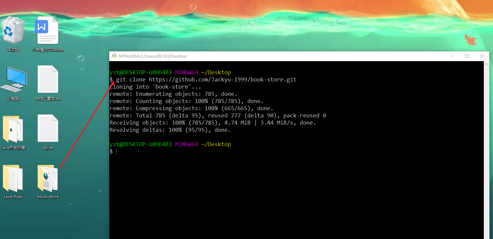

3. 也可以直接解压之后打开`IDEA`，点击`File->Open`,打开`book-store`项目。

   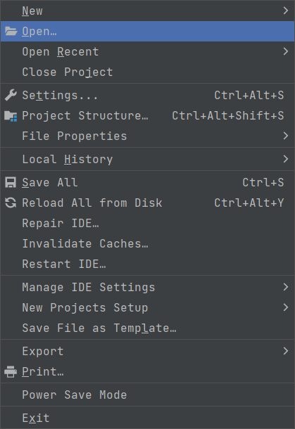

4. 打开项目之后，首先需要修改的是数据库配置文件，我这里使用的数据库版本是`mysql 8`，数据库驱动写法为`com.mysql.cj.jdbc.Driver`，如果用的是`mysql5.xx`版本，数据库驱动写法为`com.mysql.jdbc.Driver`。

   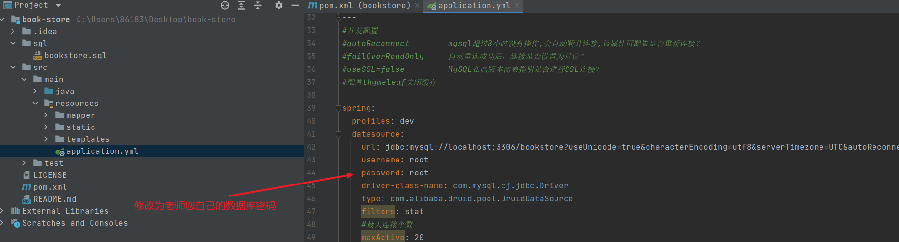

5. 接下来要把`pom.xml`里的相关依赖都加载进来，可能需要点时间，慢慢等待吧，直到看到相关依赖包名字体颜色由红色变为正常就说明依赖加载完成了。

   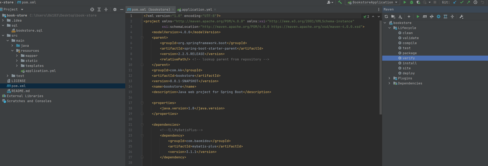

6. 趁着加载依赖的时间，可以先把数据库建起来，建议使用`navicat`直接运行我事先准备好的`sql`文件，方便快捷。

   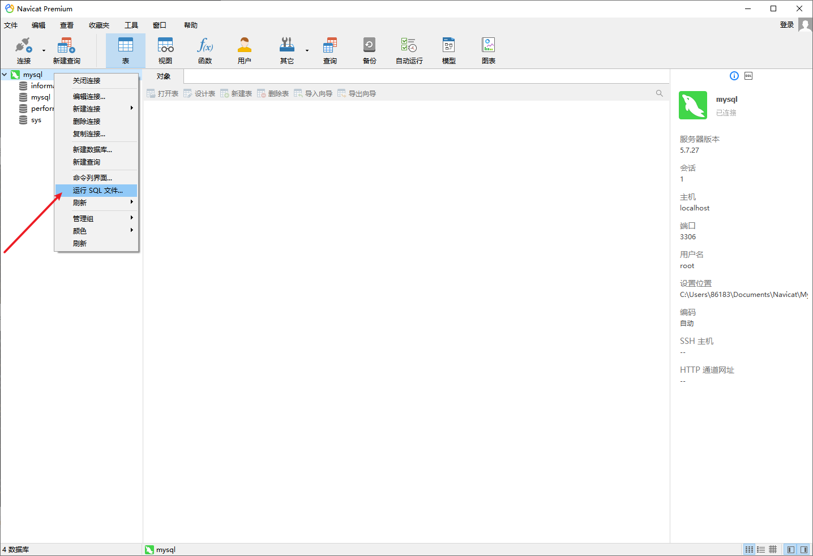

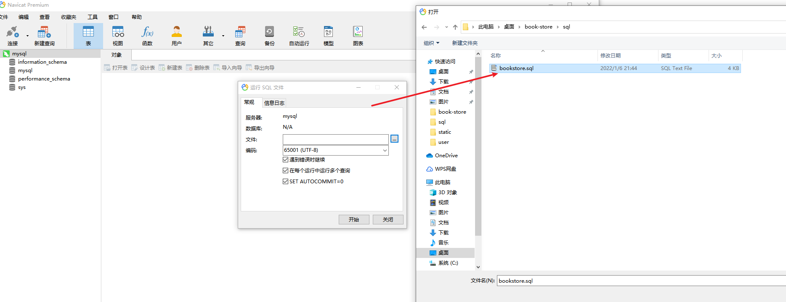

7. 刷新`navicat`窗口可以看到数据库已经有了。

   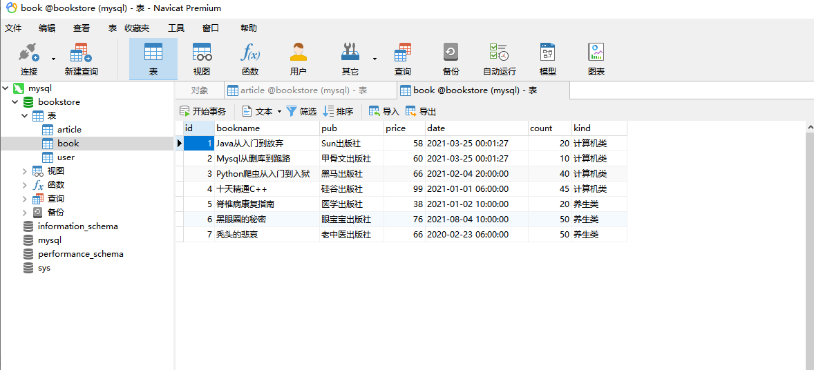

8. 先后执行`mvn clean`->`mvn compile`->`mvn package`->`mvn install`完成清除，编译，打包，打包到本地仓库一套操作，这里`IDEA`提供了可视化操作界面，可以直接点击实现，也可以用命令行。

   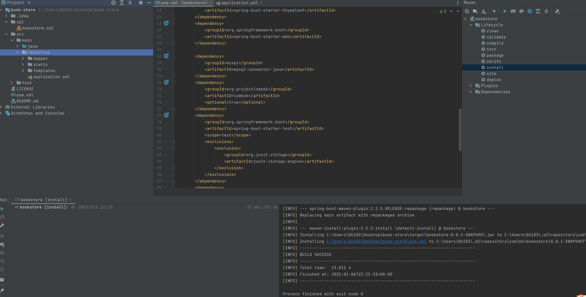

10. 点击`Run`按钮开始运行项目。

    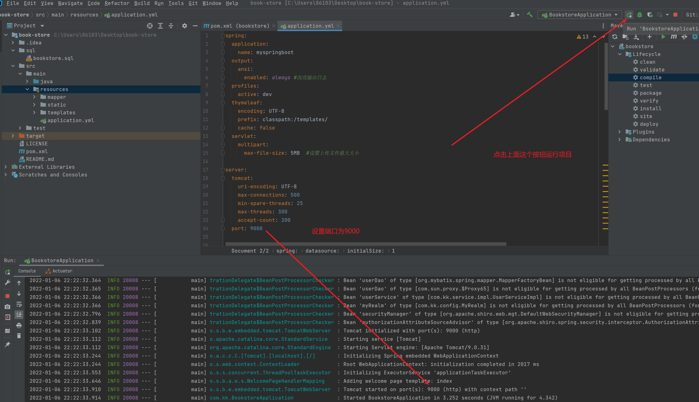

11. 打开火狐浏览器（谷歌浏览器也可以），在地址栏输入`http://localhost:9000`，回车，不出意外应该可以看到以下页面。

    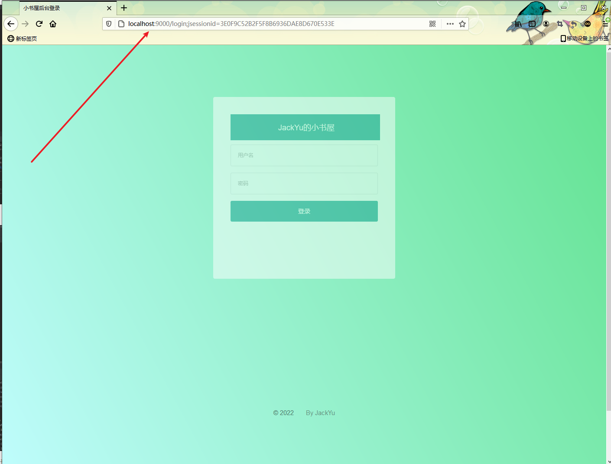

## 二：项目使用

- 登录

  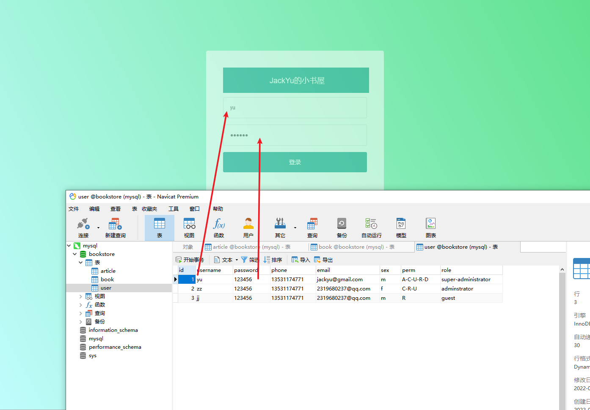

- 欢迎页面

  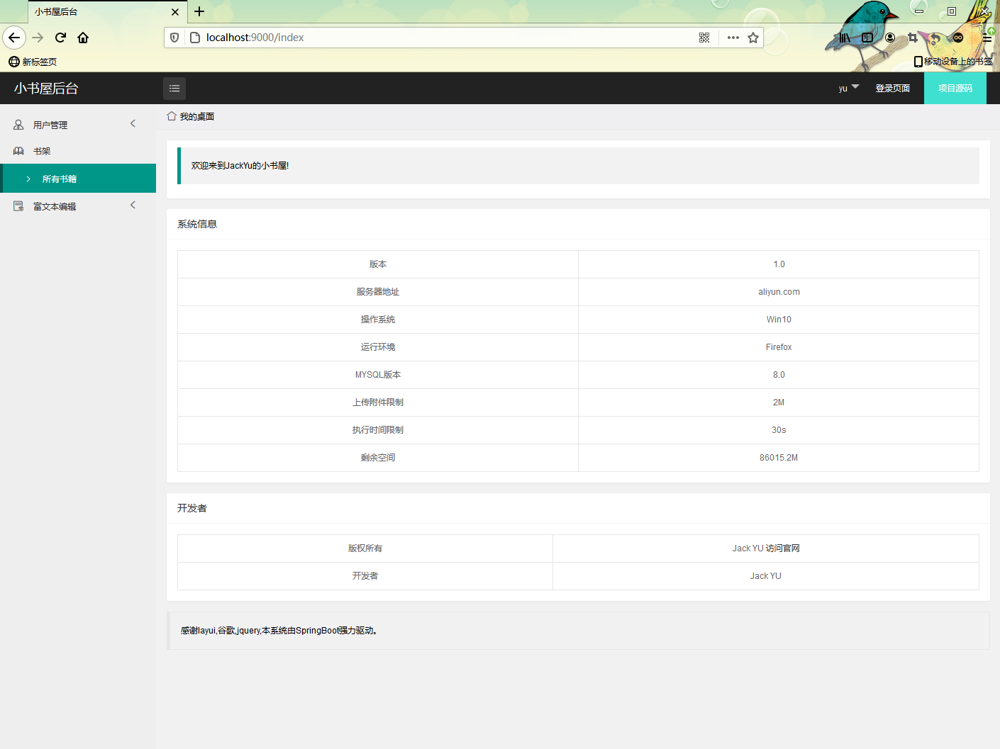

- 用户管理

  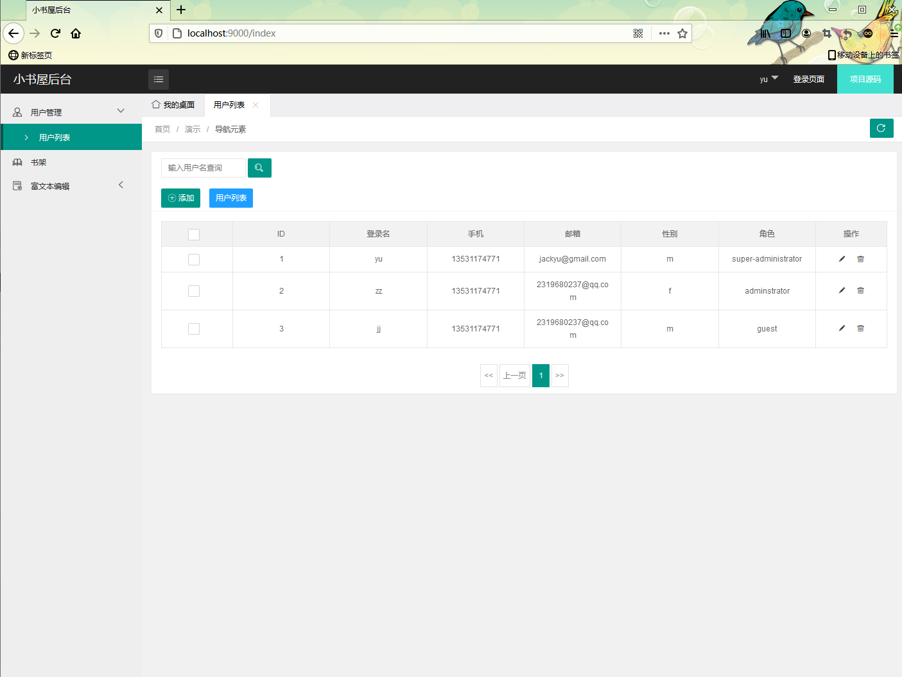

- 图书管理

  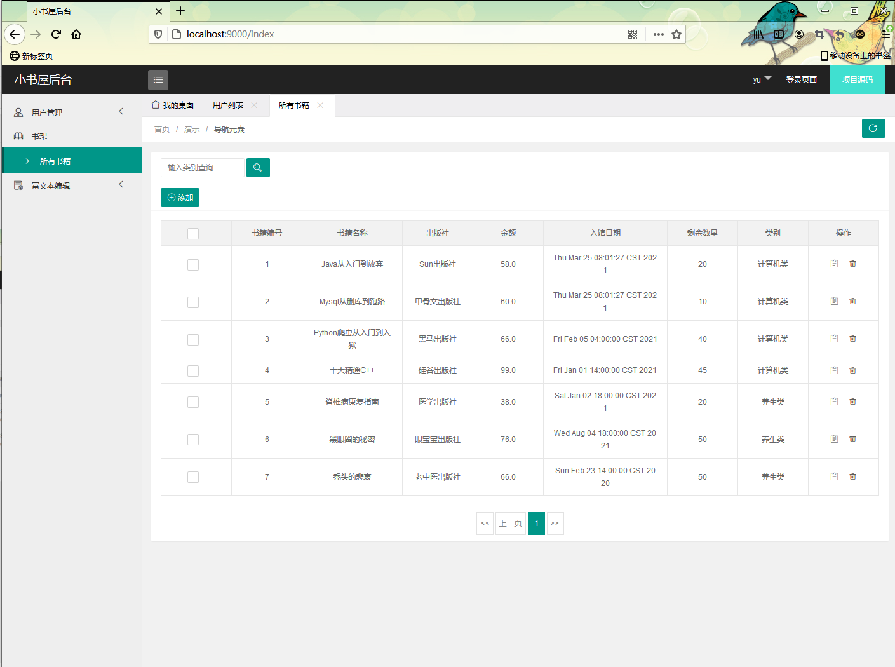

- 编辑文章

- 网络上传图片：随便找个网图把地址粘贴到图片地址和图片链接栏里面就行。

  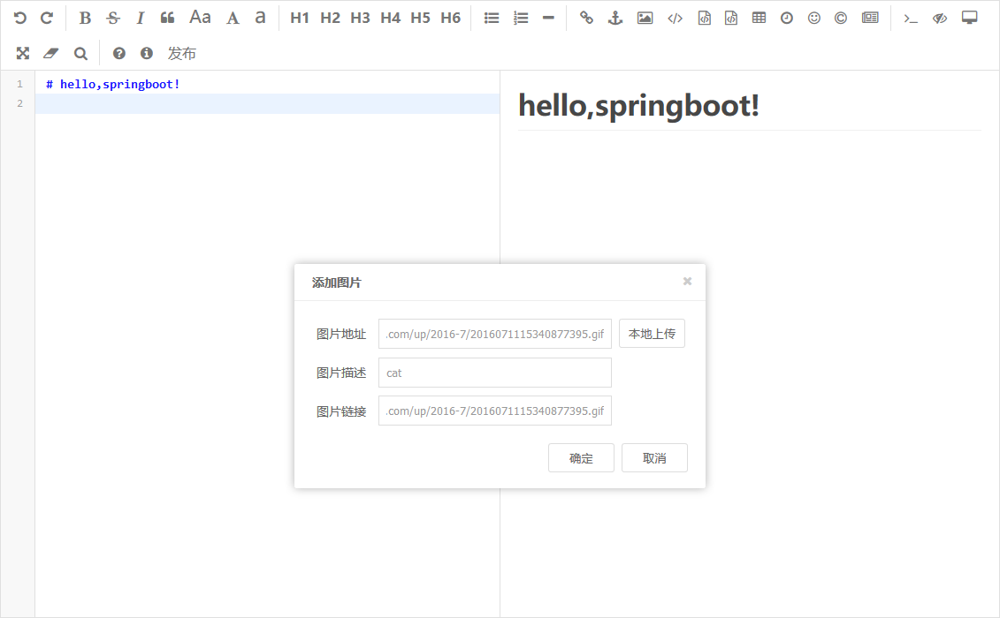

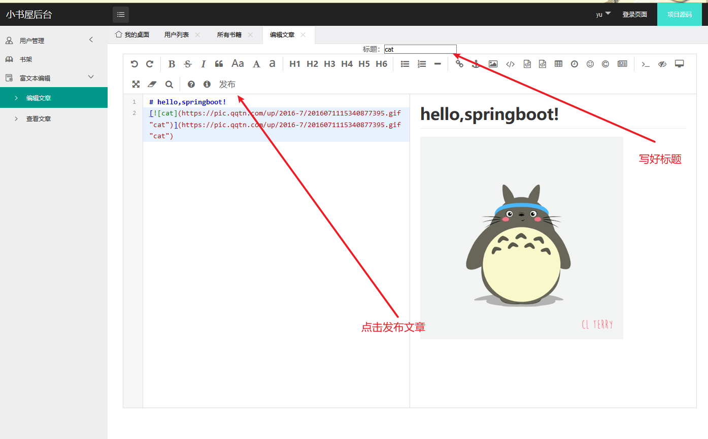

- 本地上传图片：点击本地上传按钮，在本地随便找个图片就行，图片链接栏不用填写，上传后的图片会按照月份分类保存在`upload`文件夹下面。

  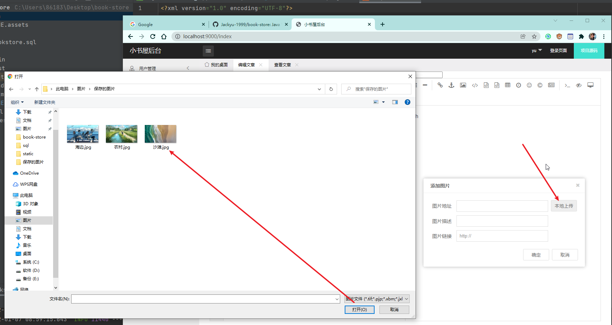

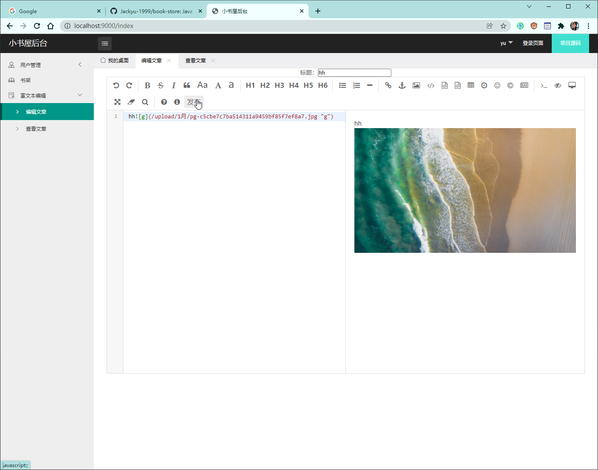